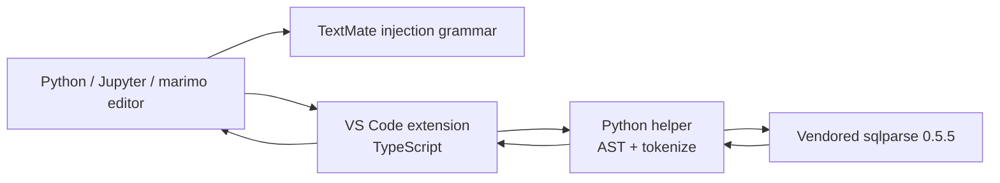

# Inline SQL Toolkit 設計

## 1. 概要

Inline SQL Toolkitは、Pythonの文字列リテラルに埋め込まれたSQLをハイライトし、
`sqlparse`で整形するVS Code拡張機能である。通常のPythonファイルだけでなく、
Jupyter NotebookのPythonセルとmarimoのPythonセルも同じ動作で扱う。

中心となる要件は、SQLを整形してもPythonのf-string式を一文字も変更しないことである。
対象が安全だと証明できない場合は、部分的な推測編集を行わず、その文字列をスキップする。

### 1.1 解決する問題

- Python文字列内のSQLが通常の文字列としてしか表示されず、読みづらい。
- SQL formatterをそのままf-stringへ適用すると、`{...}`、変換指定、format spec、
  escaped bracesを壊す可能性がある。
- Python document formatterとして登録すると、RuffやBlackなど既存のformatterと競合する。
- `.py`、Jupyter、marimoで別々の操作方法になると、利用者の認知負荷が上がる。

### 1.2 成功条件

- 対象となるSQLが`.py`、Jupyter Pythonセル、marimo Pythonセルで同じ規則により
  ハイライトされる。
- フォーマット後も、すべてのf-string式の原文が完全に一致する。
- フォーマット結果をPython 3.12以上で再度parseできる。
- フォーマットを2回実行しても2回目に差分が発生しない。
- 候補単位の非対応・安全性検証失敗ではその候補を編集せず、request全体の解析失敗、
  タイムアウト、既知の編集競合ではrequest内の編集を一切適用しない。
- Python formatterを登録せず、既存のRuff、Black、その他のformatterを置き換えない。
- VSIXに必要なPythonコードと`sqlparse`を同梱し、ネットワーク接続や
  `pip install`なしで動作する。

## 2. 確定した設計判断

| 項目 | 判断 |
| --- | --- |
| ハイライト方式 | Pythonと`mo-python`へ注入するTextMate grammar |
| フォーマット方式 | TypeScript製VS Code層と、Python製ワンショットhelperの分離 |
| SQL formatter | `sqlparse` 0.5.5をVSIXへ固定バージョンで同梱 |
| Python要件 | Python 3.12以上 |
| SQL検出 | 明示マーカー、または固定した先頭SQLキーワード |
| 自動検出設定 | 常時有効とし、無効化設定は設けない |
| 実行契機 | コマンドとCode Actionによる手動実行のみ |
| Notebook対象 | JupyterとmarimoのPythonセル内の文字列 |
| 非対象 | SQLセル、`.sql`ファイル、raw `.ipynb` JSON、SQL実行・検証 |
| dialect | 設定を設けず、`sqlparse`のdialect非依存処理を使用 |
| 安全方針 | 安全性を検証できない候補はゼロ編集でスキップ |

## 3. 対象範囲

### 3.1 MVPに含める

- `python` language IDの通常の`.py` document
- Jupyterの`jupyter-notebook`内にある、Pythonとしてparse可能な`python`セル
- marimoの`marimo-notebook`内にある、Pythonとしてparse可能な`python`または`mo-python`セル
- marimoの通常のPythonソースファイル
- 通常文字列、raw string、f-string、raw f-string
- 一重引用符、二重引用符、三重の一重引用符、三重の二重引用符
- 大文字・小文字を問わないPythonの文字列prefix
- `mo.sql(f"""...""")`、`pd.read_sql(...)`など、呼び出し先を問わない対象文字列
- カーソル位置、選択範囲、documentまたは現在のセル全体の手動フォーマット

SQL候補の判定は呼び出し先の関数名ではなく、文字列内容だけで行う。

### 3.2 MVPに含めない

- Jupyterの`%%sql`、`%sql`、SQL専用セル
- marimoのsmart SQLセル
- `.sql`ファイル
- bytes literal
- 暗黙の文字列連結
- `+`演算子による文字列連結へ参加しているliteral
- Python 3.12より前のf-string文法
- Python 3.14で導入されたt-string
- parseできない、または入力途中のPythonのフォーマット
- IPython magicやshell escapeを含み、そのままではPythonとしてparseできないNotebook cell
- 選択された任意のテキストをSQLとみなす強制フォーマット
- SQLの構文検証、dialect判定、query実行、database接続
- format on save、format on type、既定ショートカット、status bar項目

ハイライトはTextMate grammarの性質上、入力途中でも一部表示される可能性がある。
ただし、フォーマットはdocument全体をPythonとしてparseできる場合に限る。

## 4. SQL候補の検出規則

### 4.1 明示マーカー

Pythonによるescape評価前のsource上の文字列内容を検査する。物理的に書かれた空白行を
先頭から除き、最初の論理行が次のどちらかだけで構成される場合、その文字列をSQL候補とする。

```sql
-- sql
```

```sql
--sql
```

- 大文字・小文字は区別しない。
- マーカー行の前後の水平空白は許可する。
- マーカー自体はフォーマットせず、原文のまま保持する。
- マーカー後にSQLがなくても候補として認識するが、実質的なSQL tokenがなければ
  フォーマット結果は「変更なし」とする。

### 4.2 先頭キーワードによる自動検出

Pythonによるescape評価前のsource上の文字列内容を検査する。先頭に物理的に書かれた
ASCII space、tab、CR、LFを除いた最初のsource tokenが、次の固定リストに含まれる場合に
SQL候補とする。比較は大文字・小文字を区別せず、キーワードの後ろには単語境界が必要である。
`\n`などsource上のescape表記を空白として評価しない。

- `SELECT`
- `WITH`
- `INSERT`
- `UPDATE`
- `DELETE`
- `MERGE`
- `CREATE`
- `ALTER`
- `DROP`
- `TRUNCATE`
- `EXPLAIN`

この検出は常時有効であり、設定で無効化しない。先頭が同じ単語で始まる自然文を
誤検出する可能性は残るが、フォーマットは手動操作に限定するため、自動編集にはつながらない。

### 4.3 ハイライトとformatterの一致

TextMate grammarとPython helperは実装方式が異なるため、同じ検出fixtureを両方のテストへ
投入する。正しいPythonとしてparseできる文字列では、formatterが対象とする候補を
TextMate側も必ずSQLとしてscopeすることを互換条件とする。

TextMate側だけが入力途中の文字列を追加でハイライトすることは許容する。
formatter側だけが候補と判定する不一致は許容しない。

## 5. アーキテクチャ



### 5.1 TextMate injection grammar

責務はSQL候補の表示だけである。

- `source.python`と`source.mo-python`へ注入する。
- SQL部分へ`source.sql`と`meta.embedded.inline.sql`相当のscopeを付与する。
- f-stringの式領域をSQLより高い優先度のislandとして扱い、Python grammarのscopeを維持する。
- VS Codeの`embeddedLanguages`を使用し、themeが持つ既存のSQL配色を再利用する。
- formatterの対象判定や編集は行わない。

#### 5.1.1 ハイライト実現性ゲート

TextMateはparserではなく、PEP 701の任意のf-stringと埋め込みSQLの状態を組み合わせる点が
最大の技術リスクである。このため、production grammarの実装前に、実際のVS Code組み込み
Python・SQL grammarと公式marimo grammarを読み込む実現性testを最初の実装ゲートとする。

最低限、次のケースで、補間前後のSQL scope、補間内のPython scope、scopeの非漏出を
すべて満たす必要がある。

- SQL token間の単純な`{expression}`
- SQL quoted string内の`'{expression}'`
- debug `=`、conversion、nested format spec
- PEP 701で許可される改行、コメント、同種quote、nested f-stringを含む式
- 1つのf-stringに複数のreplacement fieldがある場合
- `{{`、`}}`とreplacement fieldが隣接する場合

最低対応版VS Codeとstableの両方で1ケースでも満たせなければ、production実装へ進まない。
その場合は、f-stringハイライトの範囲縮小、Python grammarの保守、semantic token方式の
いずれも自動選択せず、設計レビューへ戻って利用者の承認を得る。このゲートは要件を
弱めるためのfallbackではなく、選択済みTextMate方式が受け入れ基準を満たす前提条件である。

### 5.2 VS Code extension層

TypeScriptで実装し、次の責務だけを持つ。

- コマンドとCode Actionの登録
- 現在のeditor、document、notebook cell、選択範囲の解決
- 使用するPython interpreterの解決とバージョン確認
- Python helperの起動、キャンセル、5秒タイムアウト
- request時のdocument versionとsourceの保持
- helper応答の検証
- 適用直前の既知の競合を検査し、重複しない安全なeditを1つの`WorkspaceEdit`として適用
- 成功、変更なし、部分成功、失敗の利用者向け通知

Pythonのdocument formatting providerやrange formatting providerは登録しない。

### 5.3 Python helper

Python 3.12以上で動くワンショットprocessとする。

- stdinからversion付きJSON requestを1件受け取る。
- document全体をASTとtokenizeで解析する。
- 1回のrequestで必要なすべての対象文字列を処理する。
- stdoutへversion付きJSON responseを1件だけ返して終了する。
- stdoutにはresponse JSONだけを出力し、置換文字列はprotocol payload内だけに含める。
- stderr、追加log、通知にはSQL本文とf-string式を出力しない。
- document URI、workspace path、Notebookファイル自体を必要としない。

TypeScript層とhelperのprotocolは、VS Codeと同じ0始まりの
`line`・UTF-16 `character`位置を使う。helper内部でPythonのUnicode code point位置と、
ASTが返す行内UTF-8 byte offsetとの対応表を作る。

responseの各editは、範囲、置換文字列、元の範囲に期待する文字列を持つ。
TypeScript層はedit適用直前にdocument versionと期待文字列を再確認する。
VS Codeの`WorkspaceEdit`にはversion付きの原子的preconditionがないため、この確認後に起きる
同時編集まで絶対に排除できるとは表明しない。`applyEdit()`が`false`を返した場合は成功として
扱わず、追加editやretryも行わない。

### 5.4 Vendored `sqlparse`

- PyPIの`sqlparse` 0.5.5を固定して同梱する。
- 利用者環境の`sqlparse`は参照しない。
- `pip install`は実行しない。
- upstreamのライセンス本文と第三者通知をVSIXへ含める。
- upstreamが持つ再帰深度やtoken groupingの安全制限を無効化しない。

## 6. ハイライト設計

### 6.1 対象scope

grammarは次の文字列形式を認識する。

- prefixなし
- `r`
- `f`
- `rf`
- `fr`
- 上記prefixの大文字・小文字の組み合わせ
- `'...'`
- `"..."`
- `'''...'''`
- `"""..."""`

`b`を含むprefixは対象外とする。t-stringも対象外とする。

### 6.2 f-stringのscope境界

SQL scopeはf-stringのliteral部分にだけ付与する。次の領域はPython scopeのまま残す。

- `{expression}`
- `{expression=}`
- `{expression!r}`
- `{expression:format_spec}`
- format spec内にあるnested replacement field

`{{`と`}}`はSQL側のliteral braceとして扱う。任意にネストしたPython式を
SQL用の正規表現でparseせず、式islandからPython grammarへ委譲する。
この委譲とscope復帰が正しいことは5.1.1のゲートで実grammarを使って証明する。

### 6.3 themeとsemantic token

拡張機能独自の固定色は定義しない。標準的なSQL scopeを付与し、
利用中のthemeへ表示を委ねる。Python拡張機能などがsemantic tokenを上書きする場合は、
grammar scope testに加えて実際のVS Code統合testで退行を検出する。

## 7. フォーマット処理

### 7.1 全体フロー

1. TypeScript層が対象の`TextDocument`、version、text、cursorまたはselectionを取得する。
2. 入力上限とPython 3.12以上を確認する。
3. helperを起動し、document text、対象mode、位置、format設定を送る。
4. helperがdocument全体をASTとtokenizeでparseする。
5. 対応する単独の文字列構文単位を列挙し、SQL検出規則を適用する。
6. cursor、selection、allの規則に従って処理対象を絞る。
7. f-string式などの保護領域を衝突しないnonce markerへ置き換える。
8. 保護済みSQLを`sqlparse.format()`へ渡す。
9. markerを原文へ完全に復元する。
10. 置換後のdocument全体を再parseし、不変条件を検証する。
11. 安全な候補だけを、重複しないeditとskip reasonとして返す。
12. TypeScript層がversion、期待文字列、範囲の非重複を再検証し、
    すべてのeditを1回で適用する。

helperの途中段階で候補ごとに失敗しても、`Format All`では安全な別候補の処理を継続する。
一方、documentのparse失敗、protocol違反、process異常、タイムアウトではrequest全体を失敗とし、
editを返さない。

### 7.2 文字列範囲の特定

- ASTから`Constant`または`JoinedStr`を列挙する。
- 通常文字列はtokenizeの`STRING`と元sourceを使い、prefix、開始delimiter、内容、
  終了delimiterを分離する。
- f-stringは、対応する`FSTRING_START`から、nesting levelが一致する`FSTRING_END`までを
  1つのtop-level token bundleとして扱う。
- bundle scannerは`FSTRING_MIDDLE`と式tokenを状態機械で走査し、replacement fieldのbrace深度、
  conversion、format spec、nested replacement field、式内のnested f-stringを追跡する。
- AST nodeのsource範囲とtop-level tokenまたはbundleを対応付ける。
- 1つのAST nodeに複数のtop-level文字列tokenまたはbundleが対応する暗黙連結はスキップする。
- `BinOp(Add)`による連結に参加するliteralもスキップする。
- bytes、t-string、終了delimiterを一意に特定できないliteralはスキップする。
- ASTの行内offsetを直接VS Code位置として使わず、UTF-8とUTF-16の変換を必ず通す。

### 7.3 f-string保護

保護対象は元sourceのsliceから取得し、ASTが正規化した表現から再構築しない。

- replacement field全体
- debug `=`
- `!s`、`!r`、`!a`
- format specとそのnested replacement field
- `{{`と`}}`
- Pythonのescape sequence
- 明示SQLマーカー

requestごとに乱数nonceを生成し、元documentにも候補にも存在しないmarkerを使う。
markerには順序番号と種類を含める。`sqlparse`後に個数、種類、順序、文字列が
完全一致しない場合、その候補をスキップする。

復元後は、すべてのreplacement fieldの原文が処理前と完全一致することを検証する。
空白、コメント、引用符、改行、debug表記、conversion、format specも変更を許さない。

### 7.4 `sqlparse`の使用

共通設定は次のとおりである。

- `strip_comments=False`
- identifier caseは変更しない
- 文字列を切り詰めない
- output formatを変更しない
- operator周辺空白は`inlineSql.format.useSpaceAroundOperators`に従う
- keyword caseは`inlineSql.format.keywordCase`に従う

`keywordCase`の`"upper"`と`"lower"`はその値を渡し、`"preserve"`は
`keyword_case`を指定しない。identifier case、`truncate_strings`、`output_format`も指定しない。

三重引用符では`reindent=True`とし、`indent_width`と`wrap_after`を設定から渡す。
単一行引用符では物理改行を生成せず、keyword caseと安全な空白調整だけを行う。
`sqlparse`が単一行候補へ改行を返した場合は、その候補をスキップする。

### 7.5 三重引用符のindent

- 開始delimiter直後と終了delimiter直前に改行があるかを保持する。
- SQLの非空行に共通する既存indentを外側indentとして取得する。
- SQL本体を外側indentから一度dedentして`sqlparse`へ渡す。
- 整形後の各非空行へ外側indentを戻す。
- `sqlparse`内部のindentには設定された`indentWidth`を使う。
- 空の先頭行、空の末尾行、closing delimiterの位置を保持する。

この規則により、Python block内の見た目のindentと、SQL内部の階層indentを分離する。

### 7.6 raw stringとdelimiterの安全性

prefixとdelimiterは変更しない。整形後の内容が同じprefixとdelimiterでは安全に表現できない場合、
escapeの追加やdelimiterの変更を試みず、その候補をスキップする。

具体的には、終了delimiterの新たな出現、raw string末尾の不正なbackslash、
quoteやescapeの構造変化を検出する。通常文字列についても、保護したescape sequenceの
個数、順序、原文が変わった場合はスキップする。

### 7.7 最終不変条件

editを返す前に、候補ごとに次をすべて検証する。

- markerがすべて正しい順序で復元されている。
- f-string replacement fieldが原文と完全一致する。
- prefixとdelimiterが変わっていない。
- 保護したescapeとescaped braceが原文と完全一致する。
- 置換後のdocument全体を、helperを実行している同じPython interpreterでparseできる。
- 同じ設定でもう一度formatした結果が同一になる。
- edit範囲が元の単独文字列構文単位全体と一致する。
- 複数editが重複しない。

冪等性確認は候補単位で2回目のformatをメモリ上で行い、差分があればスキップする。

## 8. Python interpreterとprocess管理

interpreterは次の順序で解決する。

1. 空でない`inlineSql.pythonPath`
2. Microsoft Python拡張機能の公開APIが返す、対象document用の選択済み環境
3. Python拡張機能を利用できない場合だけ、PATH上の`python3`、続いて`python`

候補interpreterへ副作用のないversion確認を行い、3.12未満ならフォーマットを実行しない。
選択環境が変わった場合は、キャッシュしたpathとversionを破棄する。

helperはisolated modeで起動し、自身のbootstrapだけが同梱vendor directoryを
import pathへ追加する。利用者の`PYTHONPATH`やuser site packageへ依存しない。
bytecode cacheも書き込まない。

### 8.1 Workspace Trust

manifestではuntrusted workspace supportを`limited`と宣言する。untrusted workspaceでは
宣言的なTextMateハイライトだけを有効にし、Pythonのversion確認を含むすべてのprocess起動と
フォーマットを無効化する。`inlineSql.pythonPath`をrestricted configurationとして宣言し、
workspaceがtrustedへ変わるまでworkspace値を解決・実行しない。

### 8.2 resource guard

- documentまたはcell textの上限: 5 MiB
- 1候補の文字列構文単位上限: 1 MiB
- 1 requestの候補上限: 1,000件
- processのhard timeout: 5秒

上限超過では編集せず、理由を通知する。利用者が操作をキャンセルした場合はprocessを終了し、
返却済みの途中結果も適用しない。

## 9. コマンドとCode Action

### 9.1 コマンド

| Command ID | 表示名 | 動作 |
| --- | --- | --- |
| `inlineSql.formatAtCursor` | Inline SQL: Format at Cursor | cursorを含むSQL候補を1件整形 |
| `inlineSql.formatSelection` | Inline SQL: Format Selection | selectionと交差するSQL候補を文字列単位で整形 |
| `inlineSql.formatAll` | Inline SQL: Format All in Document/Cell | `.py`全体、または現在のNotebook cellだけを整形 |

`Format Selection`は任意のselectionをそのままSQLへ渡さない。selectionと少しでも交差する
検出済み文字列構文単位全体を単位とする。空selectionでは実行せず、
`Format at Cursor`の利用を案内する。

Notebookでの`Format All`はNotebook全体ではなく、現在のPython cellだけを対象とする。
`Format Selection`と`Format All`は候補単位で部分成功を許可し、安全な候補のeditだけを
1つの`WorkspaceEdit`で適用する。request全体のerrorでは、すべての候補をゼロ編集とする。

### 9.2 Code Action

- 表示名: `Format inline SQL`
- kind: `refactor.rewrite`
- cursorまたは選択範囲が検出済みSQL候補と交差するときだけ提示する。
- 実際のeditはコマンドと同じpipelineを通し、別実装を持たない。

### 9.3 通知

- 1候補が正常に変更された場合は通知しない。
- 差分がない場合は短い情報通知を出す。
- 失敗または全件スキップでは、理由分類と対処方法を通知する。
- 複数候補を扱う`Format Selection`または`Format All`の部分成功では、
  変更件数とskip件数を要約する。
- SQL本文、f-string式、file pathを通知本文やoutput logへ含めない。

## 10. Notebookとmarimo

### 10.1 document selector

- 通常Python: `{ language: "python" }`または`{ language: "mo-python" }`かつNotebook外
- Jupyter: `{ notebookType: "jupyter-notebook", language: "python" }`
- marimo:
  - `{ notebookType: "marimo-notebook", language: "python" }`
  - `{ notebookType: "marimo-notebook", language: "mo-python" }`

marimoがmanaged language featureを無効にして`python`を使う場合と、
`mo-python`を使う場合の両方を扱う。

VS CodeのlanguageだけのselectorはNotebook cellにも一致し得るため、「Notebook外」は
selectorだけに依存せず、実行時に`TextDocument`がNotebookへ属するかを確認する。
Notebook commandはPython cellのtext editorにcursorがある場合だけ実行し、
cell editorにfocusがなければfocusを求める通知を出す。

### 10.2 cellを通常の`TextDocument`として扱う

拡張機能はNotebookのraw JSONやmarimo file formatを直接解析しない。
VS Codeが公開する現在のcellの`TextDocument`だけをhelperへ渡す。

これにより、通常の`.py`、Jupyter、marimoで同じAST・tokenize・format pipelineを再利用し、
Notebook固有処理を対象解決に限定する。

## 11. 設定

| 設定 | 型 | 既定値 | 説明 |
| --- | --- | --- | --- |
| `inlineSql.format.keywordCase` | `"upper"`、`"lower"`、`"preserve"` | `"upper"` | SQL keywordのcase |
| `inlineSql.format.indentWidth` | integer | `2` | SQL内部のindent幅 |
| `inlineSql.format.wrapAfter` | integer | `88` | 三重引用符でのwrap目安 |
| `inlineSql.format.useSpaceAroundOperators` | boolean | `true` | operator周辺の空白 |
| `inlineSql.pythonPath` | string | `""` | interpreterの明示override |

`indentWidth`は1から8、`wrapAfter`は20から500に制限する。
無効なworkspace設定を受け取った場合は既定値へ暗黙fallbackせず、設定名を示して編集を中止する。
すべての設定はresource scopeとする。`inlineSql.pythonPath`はさらにrestricted configurationとし、
untrusted workspaceの値を参照しない。

次の設定は設けない。

- 自動SQL検出のon/off
- SQL dialect
- format on save
- arbitrary selectionの強制フォーマット
- 独自theme color

## 12. エラー処理

extension全体で安定したreason taxonomyを共有し、TypeScript層がlocalize可能な
メッセージへ変換する。helper内で検出した事象はhelperがreason codeを返し、
interpreter解決、process管理、WorkspaceEdit適用に関する事象はTypeScript層が同じtaxonomyの
reason codeを生成する。

主なreason codeは次の分類を持つ。

- `PYTHON_NOT_FOUND`
- `PYTHON_VERSION_UNSUPPORTED`
- `WORKSPACE_UNTRUSTED`
- `INVALID_CONFIGURATION`
- `DOCUMENT_PARSE_FAILED`
- `NO_SQL_CANDIDATE`
- `UNSUPPORTED_LITERAL`
- `UNSAFE_FSTRING_RESTORE`
- `UNSAFE_RAW_STRING`
- `FORMATTER_FAILED`
- `RESOURCE_LIMIT_EXCEEDED`
- `PROCESS_TIMEOUT`
- `PROCESS_CANCELLED`
- `PROCESS_FAILED`
- `DOCUMENT_CHANGED`
- `APPLY_EDIT_FAILED`
- `PROTOCOL_ERROR`

候補単位のskipはeditと同時に返せる。request全体のerrorはeditを返さない。
想定外のexceptionでもstack traceや入力内容を利用者向けlogへ出さず、診断用reason codeだけを出す。

## 13. セキュリティとプライバシー

- SQLを実行しない。
- database、network、shellへSQLを渡さない。
- telemetryを送信しない。
- document本文をdisk上の一時fileへ書かず、stdin/stdoutだけで受け渡す。
- shell文字列を組み立てず、interpreter pathとargument配列でprocessを起動する。
- VSIX内のhelper pathとvendor pathを固定し、workspaceからhelper moduleを読み込まない。
- untrusted workspaceではinterpreter pathを含むworkspace設定を実行しない。
- `sqlparse`の固定版と開発依存を継続的に脆弱性scanする。
- third-party licenseと由来をpackageへ含める。
- timeout、size上限、候補数上限により、悪意ある入力によるresource占有を制限する。

`sqlparse`は非検証parserである。フォーマット成功はSQLの正しさ、databaseでの実行可能性、
または安全性を保証しないことをREADMEとコマンド説明へ明記する。

## 14. テスト戦略

### 14.1 Python単体・ゴールデンテスト

`pytest`で次を検証する。

- markerと全先頭キーワードの検出、大小文字、空白、単語境界
- 非SQL自然文と非対象キーワード
- AST/tokenizeからのprefix、delimiter、内容、範囲抽出
- nonce衝突回避、marker個数・順序・種類の検証
- `sqlparse`前後の保護、復元、再parse、冪等性
- UTF-8 byte offset、Unicode code point、UTF-16位置の相互変換
- 部分成功とreason code
- resource上限とtimeout相当の中断

fixture行列には次を含める。

- すべての対応prefixと引用符
- leading newlineとPython block indent
- `{table}`、属性参照、index、dict、lambda、括弧内改行
- debug `=`、`!r`、`!s`、`!a`
- nested format spec
- f-string式内の文字列、コメント、brace
- `{{`、`}}`
- literalの前後と内部にある非BMP文字を含むUnicode
- SQL comment、SQL string、semicolon、複数statement
- `$1`、`?`、`:name`、`%s`、`%(name)s` placeholder
- bytes、暗黙連結、`+`連結、t-string、無効Python
- IPython magicとshell escapeを含むNotebook cellのrequest全体失敗
- raw string末尾backslash、delimiter衝突、marker破損
- 1 MiB超候補、5 MiB超document、1,000件超候補

生成testでは、対応f-string式を組み合わせ、format前後のすべてのreplacement fieldが
原文一致することをpropertyとして検証する。

### 14.2 TextMate grammar test

`vscode-textmate`と`vscode-oniguruma`を用い、Python、`mo-python`、SQL grammarを読み込む。

- SQL literal部分へSQL scopeが付く。
- f-string式部分へSQL scopeが漏れず、Python scopeが残る。
- marker検出と全自動キーワードを認識する。
- prefix、引用符、leading whitespaceを網羅する。
- bytes、対象キーワードで始まらない通常の文章、対象外文字列へSQL scopeを付けない。
- formatterと共有する検出fixtureで互換条件を満たす。
- 5.1.1の全PEP 701ケースを最低対応版とstableの実grammarで満たす。

### 14.3 TypeScript単体test

- command targetとdocument selector
- cursor、selection、allの対象解決
- JSON protocolのversionとschema検証
- interpreter解決順序とPython version判定
- workspace trust変更とuntrusted workspaceでのprocess非起動
- process cancel、5秒timeout、異常終了
- UTF-16位置のrequest・response変換
- document version raceと期待文字列の不一致
- editの範囲、非重複、一括適用
- `Format Selection`と`Format All`の部分成功集計
- 全設定値、数値境界、無効設定、`keywordCase="preserve"`の未指定mapping
- 通知にsource本文を含めないこと

### 14.4 VS Code統合test

`@vscode/test-electron`で次を実行する。

- `.py`とNotebook外の`mo-python` documentで3コマンドとCode Actionが動作する。
- 合成Jupyter NotebookのPython cellで同じ動作をする。
- 合成marimo Notebookの`python`と`mo-python` cellで同じ動作をする。
- `Format All`が現在のcell外を編集しない。
- Python document formatting providerを登録していない。
- 既知のdocument versionまたは期待文字列不一致でeditを適用しない。
- 1回の操作が1回のundoで戻る。
- helperをnetworkなしで起動できる。

通常のpull request testでは合成Notebookを使用する。週次互換jobでは、その時点の公式Jupyter拡張機能と
marimo拡張機能をインストールし、notebook typeとlanguage IDの変更を検出する。

### 14.5 CIとpackage test

- OS: Ubuntu、macOS、Windows
- Python: 3.12、3.13、3.14
- VS Code: 最低対応版1.95.0とstable
- lint、型検査、単体test、grammar test、統合test
- VSIX生成と内容物検査
- clean環境でのVSIX install smoke test
- networkを遮断した状態でのformat smoke test
- vendored `sqlparse`のversion、hash、license notice検査
- dependencyとVSIX内容物への脆弱性scan

最低対応版1.95.0では組み込み・fixture grammarと合成Notebookによるtestを実行する。
その時点の公式Jupyter・marimo拡張機能をインストールする互換testは、それらの
`engines.vscode`を満たすstableだけで実行する。

100 KiBの三重引用符SQLを通常1秒以内に処理することを性能目標とする。
共有CIの揺らぎを考慮して1秒は計測・退行検知の目標とし、機能testのhard gateは5秒timeoutとする。

## 15. 受け入れ基準

MVPは次をすべて満たしたときに完成とする。

1. `.py`、Pythonとしてparse可能なJupyter Python cell、marimoの
   `python`・`mo-python` cellで、
   対象SQLへ期待するscopeが付く。
2. 明示マーカーと固定先頭キーワードの検出結果が、grammarとformatterで一致する。
3. すべての対応f-string fixtureでreplacement fieldの原文が完全に保存される。
4. Python 3.12、3.13、3.14の各CI jobで、そのversionに対応するfixtureの
   formatter結果を同じinterpreterでparseできる。
5. 同じ設定で2回formatしても2回目に差分がない。
6. 候補単位のunsupported、marker破損、raw string危険では当該候補を編集せず、
   request全体のparse失敗とtimeoutでは全候補を編集しない。
7. 適用直前に検出したdocument versionまたは期待文字列の不一致ではeditを適用せず、
   `applyEdit()`失敗を成功として扱わない。
8. `Format Selection`が文字列の一部だけを置換しない。
9. Notebookの`Format All`が現在のcell外を変更しない。
10. Pythonのdocument formatterまたはrange formatterとして候補に表示されない。
11. VSIXだけで同梱`sqlparse`を使用し、`pip install`やnetworkを要求しない。
12. untrusted workspaceでprocessを起動せず、フォーマットを適用しない。
13. SQL本文とf-string式をprotocol payload以外のlog、通知、telemetryへ送出しない。
14. third-party license、固定version、脆弱性scanがpackage testを通る。
15. すべての公開設定の値と境界値が定義どおり反映され、無効設定では編集しない。

## 16. 主なリスクと対策

| リスク | 対策 |
| --- | --- |
| TextMateとAST検出のずれ | 共有fixtureと「formatter対象は必ずhighlight」の互換test |
| TextMateでのPEP 701境界維持が不可能 | production実装前の実grammarゲート。不合格なら実装を止め設計レビューへ戻る |
| 複雑なPEP 701 f-stringの破損 | 原source sliceによる保護、完全復元、document再parse、冪等性test |
| Unicode位置のずれ | UTF-8・code point・UTF-16を明示変換し、非BMP文字をtest |
| `sqlparse`によるmarker変形 | markerの個数・順序・原文を検証し、不一致ならゼロ編集 |
| dialect固有SQLの不完全な整形 | dialect対応を標榜せず、非検証formatterであることを明記 |
| Python環境がない、または古い | 解決順序を固定し、3.12未満では対処方法を通知 |
| Jupyter・marimo側identifierの変更 | 合成testに加え、公式拡張機能を使う週次互換job |
| 大きい入力や病的token列 | size・件数上限、upstream制限、process timeout |
| formatter競合 | VS Code formatting providerを登録せず、専用コマンドだけを提供 |

## 17. リリース境界

最初の公開版に、本設計の`.py`、Jupyter、marimo対応をすべて含める。
実装は内部的に段階化できるが、Notebook対応やf-string安全検証を後続版へ先送りしない。

SQL cell、dialect plugin、format on save、任意selection強制formatは、
利用実績と個別の設計レビューなしに追加しない。

## 18. 参照資料

- [Inline SQL Syntax - Visual Studio Marketplace](https://marketplace.visualstudio.com/items?itemName=qufiwefefwoyn.inline-sql-syntax)
- [barklan/inline_sql_syntax](https://github.com/barklan/inline_sql_syntax)
- [VS Code Syntax Highlight Guide](https://code.visualstudio.com/api/language-extensions/syntax-highlight-guide)
- [VS Code Programmatic Language Features](https://code.visualstudio.com/api/language-extensions/programmatic-language-features)
- [VS Code Notebook API](https://code.visualstudio.com/api/extension-guides/notebook)
- [Microsoft Python Extension API](https://github.com/microsoft/vscode-python/blob/main/pythonExtensionApi/README.md)
- [marimo-lsp VS Code extension manifest](https://github.com/marimo-team/marimo-lsp/blob/main/extension/package.json)
- [sqlparse documentation](https://sqlparse.readthedocs.io/en/latest/)
- [sqlparse 0.5.5 on PyPI](https://pypi.org/project/sqlparse/0.5.5/)
